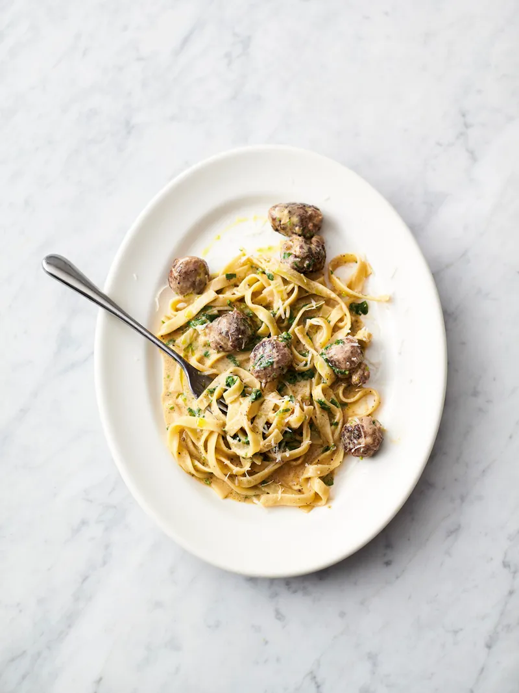
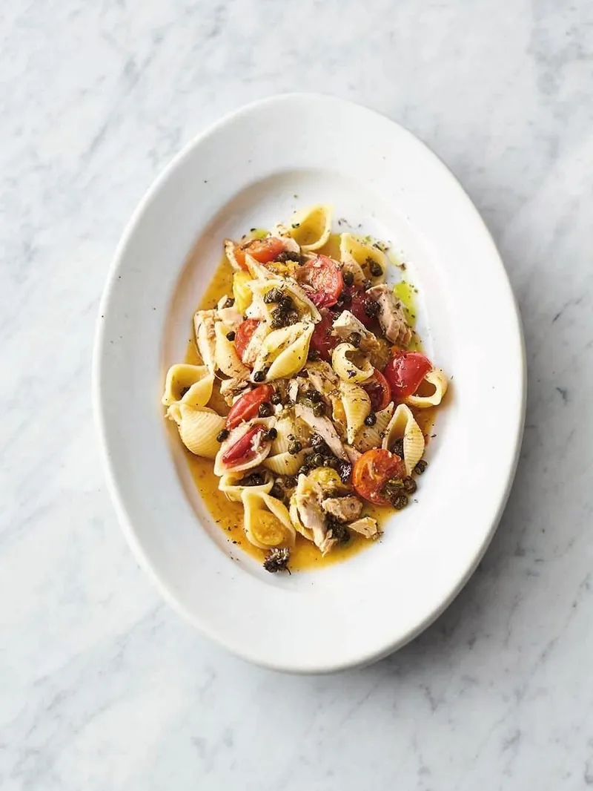
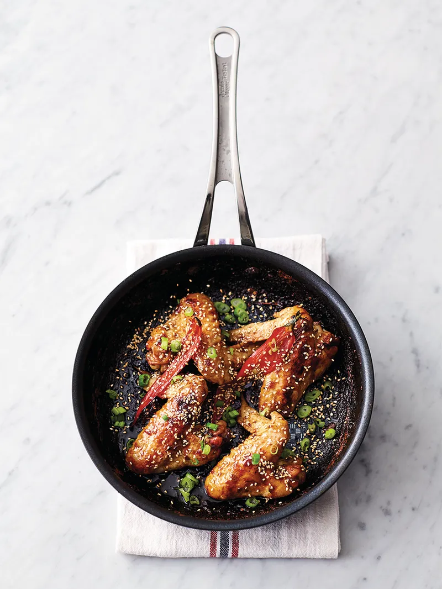

lang=en
# Breakfast
## Eggs
### Asian fried eggs
2 Servings, 10 minutes
p. 82
#### Ingredients
- 2 scallions
- 1-2 fresh mixed-color chilies
- 2 heaping tablespoons mixed raw sesame seeds
- 4 large eggs
- 2 tablespoons hoisin sauce
#### Instructions
1. Trim the scallions, very finely slice at an angle with the chillies, pop both into a bowl of ice cold water, add a swig or red wine vinegar and put aside.
2. Place a large non-stick frying pan on a medium high heat and lightly toast the sesame seeds for 1 minutes. Drizzle 1 tablespoon of olive oil, then crack in the eggs. Put a lid on the pan, and fry to your liking.
3. Place the eggs on your plate. From a height, drizzle over the hoisin (loosening with a splash of water first, if needed). Drain and scatter over the scallions and chilies, stab the yolks and enjoy.
# Lunch
## Sandwich
### Steak sandwich
2 Servings, 14 minutes
p. 193
#### Ingredients
- 8 oz strip loin steak (ideally about 3/4 inch thick)
- 1 large onion
- 2 teaspoons yellow mustard
- 4 slices of nice bread (1 3/4 oz each ???lmao)
- 1 3/4 oz provolone or fontina cheese
#### Instructions
1. Pull the fat off the strip loin, finely slice the fat and plate it in a large cold non-stick frying pan. Put on a medium-high heat to render as it heats up, moving it around to coat the pan, while you peel and slice the onion into 1/2 inch thick rounds.
2. Add them to the pan to char for 10 minutes, turning halfway. Meanwhile, cut off the sinew, then place the steak between two sheets of parchment paper and pound with your fist until just under 1/2 inch thick.
3. Sprinkle with a pinch of sea salt and black pepper, then brush all over with the mustard and cut into two
4. Add a good splash of red wine vinegar to the onion, toss for 1 minute over the heat, then divide between two slices of bread, leaving the pan on the heat.
5. Sear the steaks in the screaming hot pan for just 40 seconds on each side, then slice and lay over the cheese, cover, then turn the heat off and leave to melt for just 40 seconds more.
6. Lay the steak on top of the onion, pop the other slices of bread, drizzle with a little virgin olive oil and enjoy.
## Salad
### Hoisin Chicken Lettuce Cups
2 Servings, 17 minutes
p. 14
#### Ingredients
- 1 ripe mango
- 2 tablespoons hoisin sauce
- 2x4oz boneless skinless chicken breast
- 1 romaine lettuce (10oz)
- 1 cup sprouting cress
#### Instructions
1. Put  a grill pan on high heat. Cut the two cheeks off the mango, slice each into three lengthways, then slice off the skin and discard. Dice all the flesh into 1/2-inch cubes.
2. Scrunch the stone over a bowl, to extract and pulp and juice mix with the hoisin to make a dressing and divide between two little bowls.
3. Flatten the chicken breasts by pounding them with your fists until the fat end is the same thickness as the skinny end. Rub with 1 tablespoon of olive oil and a punch of sea salt and black pepper, then grill for 2 to 3 minutes on each side or until bar marked and cooked through. 
4. Meanwhile, trim the lettuce, click the leaves apart and divide between two plates, snipping the cress alongside.
5. Divide up the mango and the hoisin bowl, Slice the chicken and arrange on the plates, then tuck in, using the lettuce cups as a receptacle to hold everything. 
### Prosciutto celeriac salad
2 Servings, 10 minutes
p. 43
#### Ingredients
- 7 oz celery root
- 2 teaspoons whole grain mustard
- 2 heaping tablespoons Greek yogurt
- 1/2 a bunch of fresh tarragon (1/2 oz)
- 4 slices of prosciutto
#### Instructions
1. Peel the celery root, then finely slice into matchsticks with good knife skills, using the julienne cutter on a madolin or a coarse box grater
2. In a bowl, dress the celery root with the mustard, yogurt and 1 tablespoon each of extra virgin olive oil and red wine vinegar. Scrunch and massage together. Pick in the tarragon leaves, mix well, then taste and season to perfection with sea salt and black pepper.
3. Divide between two plates, then wrap the prosciutto in waves around the outside. 
4. Drizzle with 1 teaspoon of extra virgin olive oil and sprinkle from a height with a pinch of pepper.
### Sweet potato salad
2 Servings, 9 minutes fast-prep, 1 hours slow-cook 
p. 45
#### Ingredients
- 2 large sweet potatoes (10 oz each)
- 1 lb ripe mixec-color tomatoes
- 4 scallions
- 1 3/4 oz arugula
- 1 1/2 oz feta cheese
#### Instructions
1. Preheat oven to 350F. Scrub the sweet potatoes clean, place in a roasting pan and bake for 1 hour, or until soft through
2. Once done, roughly chop the tomatoes, trim and finely slice the scallions, then toss it all with 1 tablespoon of extra virgin olive oil and a splash of red wine vinegar. Taste and season with sea salt and black pepper
3. Tear the soft sweet potatoes between 2 plates. Toss the arugula through the tomatoes, then pile on top. 
4. Crumble over the feta, drizzle with 1 teaspoon of extra virgin olive oil and sprinkle from a height with a pinch of pepper

# Dinner

## Starter

## Pasta
### Easy sausage carbonara
2 Servings, 18 minutes
p. 53

#### Ingredients
- 5 oz dried tagliatelle
- 3 sausages
- 1/2 a bunch of fresh Italian parsley (1/2 oz)
- 1 large egg
- 1 oz Parmesan cheese
#### Instructions
1. Cook the pasta in a pan of boiling salted water, the drain reserving a cupful of cooking water
2. Meanwhile, squeeze the sausage meat out of the skins, then with wet hands, quickly shape into 18 even-sized balls. Roll and coat them in black pepper, then cook in a non-stick frying pan on medium heat with 1/2 a tablespoon of olive oil until golden and cooked through, tossing regularly, then turn the heat off
3. Finely chop the parsley, stalks and all. Beat with it the egg and plash of pasta cooking water. Then finely grate and mix in most of the Parmesan
4. Toss the drained pasta into the sausage pan, pour in the egg mixture and toss for 1 minute off the heat (the egg will gently cook in the residual heat). Loosen with a good splash of reserved cooking water, season with sea salt and pepper and finely grate over the remaining Parmesan
### Sicilian tuna pasta
4 Servings, 14 minutes
p. 61

#### Ingredients
- 10 oz dried pasta shells
- 4 heaping teaspoons baby capers
- 1 lb ripe mixed-color cherry tomatoes
- 1 tablespoon dried oregano. Ideally the flowering kind
- 8 oz tuna packed in olive oil
#### Instructions
1. Cook the pasta in a pan of boiling salted water
2. Meanwhile, place a large non-stick frying pan on a medium-high heat with 1 tablespoon of olive oil. Add the capers, fry until super-cripsy, then scoop out and put aside, leaving the fragrant oil behind
3. Halve and add the tomatoes to the frying pan, then sprinkle in most of the oregano. Drain and flake in the tuna, add 2 ladleful of pasta cooking water; simmer until the pasta is done
4. Drain the pasta, reserving a cupful of cooking water, then toss the pasta into the tuna pan, loosening with a splash of reserved cooking water, if needed.
5. Taste, season to perfection with sea salt and black papper, then dish up. 
6. Sprinkle over the crispy capers and the remaining oregano from a height, drizzle with 1 teaspoon of extra virgin olive oil and tuck in.

### Pork porcini pasta
4 Servings, 30 minutes
p. 69
#### Ingredients
- 1 oz dried porcini mushrooms
- 10 oz ground pork
- 1 onion
- 10 oz dried penne
- 1 3/4 oz Parmesan cheese
#### Instructions
1. In a small bowl, cover the dried porcini with 1 2/3 cups of boiling kettle water.
2. Place the ground pork in a large shallow casserole pan with 1 tablespoon of olive oil, then break it up and fry on a high heat, stirring regularly.
3. Meanwhile, peel and finely chop the onion then the drained porcini, reserving the soaking water
4. Stir the onion and porcini into the pan and fry for 10 minutes, or until golden.
5. Add 1 tablespoon of red wine vinegar and the porcini water (discarding the last gritty bit).
6. Simmer for 10 minutes on a low heat while you cook the pasta in a pan of boiling salted water, reserving a good cupful of cooking water.
7. Toss the drained pasta into the pork pan with 1 cup of reserved cooking water, then finely grate in most of the Parmesan and season to taste with sea salt and black pepper.
8. Toss over a low heat for 2 minutes to emulsify the sauce then dish up.
9. Finely grate over the remaining Parmesan, drizzle with a little extra virgin olive oil and enjoy.

## Chicken
### Sticky kickin' wings
2 Servings, 6 minutes fast-prep, 40 minutes cook
p. 97

#### Ingredients
- 1 tablespoon raw sesame seeds
- 4 large chicken wings
- 2 tablespoons teriyaki sauce
- 1 fresh red chili
- 2 scallions
#### Instructions
1. Toast the sesame seeds in a dry 8-inch non-stick frying pan on a medium heat until lightly golden, then remove to a plate.
2. Still on the heat, sit the wings in the pan - they should fit snugly. 
3. Let them color for 1 minute on each side, then add the teriyaki and just cover the wings with water.
4. Halve the chili length ways and add to the pan
5. Simmer for 35 to 40 minutes or until the chicken is tender and the sauce is nice and sticky, turning occasionally.
6. Add a splash of red wine vinegar to the pan and jiggle around to pick up the gnarly bits
7. Trim and finely slice the scallions, scatter them over the chicken with the toasted sesame seeds and get stuck in.

### Chicken noodle stir-fry
2 Servings, 16 minutes
p. 101
#### Ingredients
- 1 oz unsalted peanuts
- 2x 4 oz boneless, skinless chicken breast
- 2 tablespoon black bean sauce
- 5 oz medium egg noodles
- 7 oz broccolini
#### Instructions
1. Place a large non-stick frying pan on a medium heat and toast the peanuts as it heats up, tossing regularly, then remove an set aside, leaving the pan on the heat
2. Meanwhile, score the chicken lengthways at 1/2 inch intervals, going about halfway through.
3. In a bowl, toss the chicken with 1 tablespoon each of olive oil, red wine vinegar and black bean sauce to coat.
4. Cook in the hot pan for 3 minutes on each side or until dark, gnarly and cooked through
5. Cook the noodles in a large pan of boiling salted water
6. Trim the broccolini (halving any thick stalks lengthways) and add to the water for the last 2 minutes.
7. Remove the chicken to a board. Use tongs to carefully drag the just cooked noodles and broccolini with a bit of their water straight into the frying pan.
8. Pound half the peanuts in a pestle and mortar until fine, toss into the pan with remaining black bean sauce until well mixed, then divide between your plates
9. Slice the chicken and place on top, scatter over the remaining peanuts drizzle with a little extra virgin olive oil and dig in.
### Crispy garlic chicken
2 Servings, 20 minutes
p. 109
#### Ingredients
- 2x 4 oz boneless chicken
- 2 thick slices of whole wheat break with seeds (2 1/2 oz each)
- 1 clove of garlic
- 1 lemon
- 1 3/4 oz arugula
#### Instructions
1. Place the chicken breasts between two large sheets of parchment paper and whack with the base of a large non-stick frying to flatten them to about 1/2 inch thick.
2. Tear the bread into a food processor(blender) then peal, chop and add the garlic and blitz into fairly fine crumbs.
3. Pour the crumbs over the chicken, roughly pat onto each side, then re-cover with the paper and whack again to hammer the crumbs into the chicken and flatten them further
4. Out the pan on a medium heat. Fry the crumbed chicken in 1 tablespoon of olive oil for 3 minutes on each side or until crisp golden and cooked through.
5. Slice, plate up, season with sea salt and black pepper, sprinkle with lemon dressed arugula and serve with lemon wedges for squeezing over.
### Flaky pastry pesto chicken
4 Servings, 30 minutes
p. 115
#### Ingredients
- 11 oz sheet of all-butter puff pastry (cold)
- 4x 5 oz boneless, skinless chicken breast
- 4 heaping teaspoons green pesto
- 14 oz ripe cherry tomatoes on the vine
- 14 oz green beans
#### Instructions
1. Preheat the oven to 425F
2. Unroll the pastry, cut it in half lengthways, then cut each half widthway into 8 equals strips.
3. Flatten the chicken breasts by pounding with your fist until the fat ends are the same thickness as the skinny ends.
4. Place them in a roasting pan, season with sea salt and black pepper, spread over the pesto then lay 4 overlapping strips of pastry over each breast, tucking them under at the edges.
5. Brush with a little olive oil. Lightly dress the tomato bines in olive oil, season and put into a second pan.
6. Place the chicken pan on the top shelf of the oven with the tomatoes below and cook for 20 minutes or until the pastry is golden and the chicken is cooked through
7. Meanwhile, line up the beans, trim off just the stalk ends, then cook in a pan of boiling salted water for 7 minutes or until tender.
8. Remove the chicken to a board with half the tomatoes, squashing the rest in the pan and discarding the vines.
9. Drain and toss in the beans, taste and season. Slice the chicken at an angle and serve on top of the beans, with the whole tomatoes.

### Herby chicken traybake
2 Servings, 6 minutes fast-prep, 50 minutes cook
p. 121
#### Ingredients
- 14 oz potatoes
- 2x 7 oz chicken legs
- 6 cloves of garlic
- 2 prigs of fresh rosemary
- 1 lemon
#### Instructions
1. Preheat over to 350F.
2. Scrub potatoes, slice just under 1/4 inch thick and place in a 12x10 inch pan with the chicken, 1/2 a tablespoon of olive oil and a pinch of sea salt and black pepper.
3. Lightly squash and add the unpeeled garlic cloves, toss well then arrange the spuds in a fairly even layer.
4. Sit the chicken legs directly on the bars of the oven, skin side up with the pan of potatoes directly underneath.
5. Bake for 40 minutes.
6. When the time is up, mix up the potatoes in the tasty pan juices, then sit the chicken on top.
7. Strip the rosemary leaves off  the sprigs, use a vegetable peeler to peel strips of lemon zest then toss both in 1 teaspoon of olive oil and sprinkle into the pan.
8. Squeeze over half of the lemon juice then return to the oven for a final 10 minutes or until the chicken is tender and super golden.
## Fish & Seafood
### Crazy simple fish pie
4 servings, 20 minutes
p. 127
#### Ingredients
- 14 oz undyed smoked haddock, skin off
- 2 bunches of scallions
- 8 oz baby spinnach
- 5 oz cheddar cheese
- 4 sheets of phyllo pastry
#### Instructions
1. Preheat the oven to 400F.
2. In a bowl, cover the fish with boiling kettle water. Put aside to soak while you trim and roughly chop the scallions, placing them into a 12 inch non-stick ovenproof frying pan on high heat with 1 tablespoon of olive oil.
3. Stir and fry for 2 minutes, then pile the spinach on top, let it wilt down and turn the heat off
4. Spoon 6 tablespoon of the soaking water over the spinach, then drain the fish, break up the pieces and sit them evenly around the pan.
5. Finely grate over most of the cheese and season well with black pepper.
6. Quickly layer the phyllo on top, tucking it around the fish and up the sides of the pan, tearing the last sheet on top in a nutty fashion.
7. Grate over the last bit of cheese, drizzle with a 1/2 a tablespoon of olive oil and bake for 15 to 17 minutes.
### Quick Asian fishcakes
4 Servings, 22 minutes
p.131
#### Ingredients
- 1 stick of lemongrass
- 2 1/2 inch piece of fresh gingerroot
- 1/2 a bunch of fresh cilantro (1/2 oz)
- 1 lb salmon fillets, skin off, pin-boned
- 4 teaspoons chili jam
- *1 egg*
#### Instructions
1. Whack the lemongrass against your work surface and remove the tough outer layer.
2. Peel the ginger, the very finely chop with the inside of the lemongrass and most of the cilantro, stalks and all, reserving a few nice leaves in a bowl of cold water.
3. Chop the salmon into 1/2 inch thick chunks over the mix on your board, then push half the salmon to one side.
4. Chop the rest until super-fine, almost like a puree, then mix the chunkier bits back through it and season with sea salt and black pepper *and add the egg*.
5. Divide into 4, then shape and squash into 3/4 inch thick patties
6. Place a large non-stick frying pan on a medium-high heat with 1 tablespoon of olive oil.
7. Cook the patties for 2 minutes on each side, or until nicely golden.
8. Spoon the chili jam over the fish cakes, add a splash of water to the pan, turn the heat off, and jiggle to coat.
9. Serve sprinkled with the drained cilantro.
### Seared sesame tuna
2 Servings, 10 minutes
p. 135
tags=bestOf
#### Ingredients
- 1 heaping tablespoon white miso paste
- 2x 5 oz tuna steaks (ideally 3/4 inch thick)
- 4 tablespoons raw sesame seeds
- 8 scallions
- 5 oz sugar snap peas
#### Instructions
1. Place a large non-stick frying pan on a medium-high heat.
2. Rub the miso all over the tuna then pat on the sesame seeds to cover
3. Place in the hot pan with 1 tablespoon of olive oil and sear for 1 1/2 minutes on each side, so it's beautifully golden on the outside but blushing in the middle.
4. Remove to a board to rest.
5. Quickly wipe out the pan with a ball of paper towel then return to the heat
6. Trim the scallions and slice at an angle the same length as the sugar snaps, tossing both into the hot pan with a few drips of red wine vinegar and a pinch of sea salt for 2 minutes to lightly catch and char.
7. Slice the sesame tuna and serve on top of the veg, drizzled with 1 teaspoon of extra virgin olive oil.
### Thai style crispy sea bass
2 Servings, 19 minutes
p. 151
#### Ingredients
- 4 scallions
- 1/2 a bunch of fresh cilantro (1/2 oz)
- 2x 10 oz whole sea bass, gutted, trimmed
- 2 tablespoons Thai red curry paste
- 1 lime
#### Instructions
1. Trim and halve the scallions, finely shred lengthways and place in a bowl of ice-cold water to crisp up. 
2. Pick in the cilantro leaves, reserving the stalks
3. Place a large non-stick frying pan on a medium-high heat.
4. With a sharp knife, score the sea bass at 3/4 inch intervals, then rub all over with the curry paste, inside and out, getting into all the cracks and crannies.
5. Pack the cilantro stalks into the cavities, season with sea salt and black pepper, then place in the hot pan with 1 tablespoon of olive oil.
6. Cook for 3 to 4 minutes per side or until dark golden and cooked through (depending on the thickness of your fish)
7. Drain and shake off the scallions and cilantro and pile onto your plate.
8. Sit the sea bass on top, spooning over any spicy oil from the pan.
9. Finely grate over the lime zest, and serve with lime halves, for squeezing over.
## Vegetarian
### Asparagus, eggs & French dressing
2 Servings, 15 minutes
p. 165
#### Ingredients
- 1/2 a red onion
- 4 large eggs
- 12 oz asparagus
- 1/2 a bunch of fresh tarragon (1/2 oz)
- 2 heaping teaspoons Dijon mustard
#### Instructions
1. Peel and very finely chop the red onion, place in a bowl, cover with 4 tablespoons of red wine vinegar and add a very good pinch of sea salt.
2. Lower the eggs into a pan of vigorously simmering water and boil for 5 1/2 minutes exactly. 
3. Line up the asparagus, trim off the woody ends and place in a colander above the eggs, covered, to steam while the eggs cook.
4. Meanwhile, pick the tarragon leaves.
5. In a bowl, whisk the mustard with 6 tablespoons of extra virgin olive oil, adding it gradually, then pour in the soaking vinegar from the onion through a strainer, whisking constantly.
5. Taste and season with black pepper.
6. When the time's up on the eggs, divide  the asparagus between your plates.
7. Cool the eggs under cold water until cool enough to handle, then peel, halve and plate up, sprinkled with the tarragon leaves and onion.
8. Drizzle each plate with 1 tablespoon of dressing (save the rest for another day), season from a height with a pinch of pepper, and dig in.
### Easy rustic gnocchi
2 Servings, 30 minutes
p. 169
also=h2:Pasta
#### Ingredients
- 14 oz floury potatoes
- 12 oz asparagus
- 1/3 cup all purpose flour
- 1/2 a bunch of fresh thyme (1/2 oz)
- 1 3/4 oz Parmesan cheese
#### Instructions
1. Wash the potatoes, chop into 1 1/4 inch chunks and cook in a large pan of boiling salted water for 12 minutes or until tender.
2. Meanwhile line up the asparagus, trim off the woody ends, then slice the stalks 1/2 inch thick, leaving the tips whole
3. Drain the potatoes and steam dry for 2 minutes, then return to the pan and mash well. 
4. Taste and season with sea salt and black pepper, then tip onto a clean work work surface.
5. Fill the empty pan with boiling kettle water and divide into 24 pieces. 
6. Squeeze each in your palm to compress, into little uneven gnocchi, then drop into the boiling water for 1 minutes, or until they float.
7. Meanwhile, put the asparagus into a large non-stick frying pan on a medium-low heat with 1 tablespoon of olive oil, stirring occasionally.
8. Strip in most of the thyme leaves, then use a slotted spoon to add the gnocchi straight in.
9. Finely grate over most of the Parmesan and toss well, adding 1/2 cup of gnocchi cooking water to emulsify it into a nice sauce.
10. Taste, season, then dish up.
11. Grate over the remaining Parmesan, strip over the remaining thyme, and finish with a little drizzle of extra virgin olive oil.

## Beef
### Epic rib-eye steak
4 Servings, 26 minutes
p. 183
#### Ingredients
- 1 1/4 lb piece of rib-eye steak (ideally 2 inches thick), fat removed
- 4 sprigs of fresh rosemary
- 4 cloves of garlic
- 12 oz mixed mushroms
- 1x 23 oz jar of white beans (find them in Italian delis)
#### Instructions
1. Place a large non-stick frying on a medium-high heat.
2. Rub the steak all over with a pinch of sea salt and black pepper, then sear on all sides for 10 minutes in total so you achieve good color on the outside but keep it medium rare in the middle, or cook to your liking turning regularly with tongs.
3. Meanwhile, strip the rosemary leaves off the sprigs, peel and finely slice the garlic and tear up any larger mushrooms.
4. When the steak's done, remove to a plate and cover with aluminum foil.
5. Reduce the heat under the pan to medium and crisp up the rosemary for 30 seconds, then add the garlic and mushrooms  and cook for 8 minutes or until golden, tossing regularly.
6. Pour in the beans and their juice, add 1 tablespoon of red wine vinegar and simmer for 5 minutes, then add seasoning. 
7. Sit the steak on top and pour over any resting juices.
8. Slice and serve at the table, finishing with a little extra virgin olive oil, if you like.
### Ginger shakin' beef
2 Servings, 16 minutes
p. 185
#### Ingredients
- 10 oz strip loin steak (ideally about 3/4 inch thick)
- 1 1/2 inch piece of fresh gigerroot
- 1 tablespoon white miso paste
- 2 bok choi (8 oz)
#### Instructions
1. Pull the fat off the strip loin, finely slice the fat  and place in a cold non-stick frying pan
2. Put on a medium-high heat to crisp up while you peel and match stick the ginger then add that to crisp up too.
3. Cut off the sinew, then dice the steak into 1 1/4 inch chunks and toss with the miso until well coated.
4. Scoop the crispy fat and ginger out and put aside, then add the steak chunks to the pan. Cook for 4 minutes, tossing regularly, then drizzle in the honey and 1 tablespoon of red wine vinegar. Toss for 1 minute until shiny and sticky.
5. Meanwhile, halve the bok choy, cook in a pan of boiling water for just 1 minute so they retain a bit of crunch, then drain well and plate up.
6. Spoon over the steak and sticky juices from the pan and finish with the reserved crispy bits.
### Bangin' beef stew
4 Servings, 9 minutes fast-prep, 2 hours slow-cook
p. 195
#### Ingredients
- 4 mixed color peppers
- 1 heaping teaspoon ground allspice
- 1 3/4 lbs lean stewing beef
- 10 fresh bay leaves
- 8 cloves of garlic
#### Instructions
1. Preheat the oven to 325F. Place a large shallow casserole pan on high heat.
2. Seed the peppers and chop into fingers, then place in the pan with 1 tablespoon of olive oil, a pinch of sea salt and black pepper and the allspice.
3. Chop in the unpeeled garlic through a garlic crusher and fry for 2 minutes, tossing regularly.
4. Add 2 teaspoons of red wine vinegar and 2 cups of water to the pan.
5. Cover then cook in the oven for 2 hours or until dark and sticky. Loosen with a splash of water, if needed mix up, taste season and serve.
## Pork
### Crazy pork burger
1 Serving, 16 minutes
p. 209
#### Ingredients
- 1 ripe sweet pear
- 1 3/4 oz mixed spinach, arugula & watercress
- 5 oz ground pork
- 1 soft burger bun
- 1 oz blue cheese
#### Instruction
1. Slice the pear lengthways as finely as you can. Toss gently with the salad leaves, a little drizzle each of extra virgin olive oil and red wine vinegar and a pinch of black pepper.
2. Scrunch the ground pork in your clean hands with a punch seasoning, then shape into a 1/2 inch thick patty.
3. Rub with 1 teaspoon of olive oil, then place in a large non-stick frying pan on high heat for 2 minutes while you halve and toast the bun alongside, removing it when golden.
4. Flip the burger, then after 2 minutes, crumble the blue cheese next to it to melt. Move the burger on top of the oozy cheese, jiggle around to coat, then put it on your bun base.
5. Stack in as much pear and salad as the bun will hold, pop the lid on, squash and enjoy with extra salad on the side.
### Peachy pork chops
2 Servings, 28 minutes
p. 217
#### Ingredients
- 2x 8 oz pork chops with rind
- 4 cloves of garlic
- 2 sprigs of fresh rosemary
- 1x 15 oz can of peach halves in juice
- 1/4 cup of bourbon
#### Instructions
1. Preheat the broiler to high.
2. Slice the rind off the chops, score the fat side of it in a criss-cross fashion and place skin up in a pan. Pop under the broiler for 5 minutes to crisp up into crackling - keep an eye on it.
3. Season the chops with sea salt and black pepper, score the remaining fat in a criss-cross fashion, then sit the chops together fat edges down in a large cold non-stick frying pan.
4. Place on high heat for 3 to 4 minutes, or until golden and the fat has rendered out, using tongs to ensure they're in good contact with the pan. Gently turn the chops on their sides to cook for 5 minutes on each sides.
5. Meanwhile, peel and finely slice the garlic. Strip the rosemary leaves off the sprigs. Remove the chops to a plate, drain 90% of the fat from the pan into a jar to use for cooking another day, then sprinkle the garlic into the pan.
6. Stir regularly until golden then add the rosemary and four drained peaches halves, flat-side down. Jiggle over the heat until golden, then return the chops to the pan, add the bourbon and carefully set fire to it with a match.
7. Once the flames begin to subside, dish up with the crispy crackling.
### Sticky pork stir-fry
4 Servings, 18 minutes
p. 221
#### Ingredients
- 14 oz pork shoulder
- 14 oz mixed color baby heirloom carrots
- 8 scallions
- 2 tablespoons teriyaki sauce
- 2 tablespoons liquid honey
#### Instructions
1. Put a large shallow casserole pan on high heat.
2. Chop the pork into 1 1/4 inch chunks and place in the pan with 1 tablespoon of olive oil and a pinch of sea salt and black pepper.
3. Trim and add the whole baby carrots (halving any larger ones), then cook for 12 minutes or until everything is golden tossing regularly.
4. Meanwhile trim and slice the scallions
5. Add a splash of water to the pan to deglaze it, then stir in the scallions, teriyaki sauce and honey.
6. Cook for another 3 minutes, tossing regularly until it's all shiny and sticky, then taste, season and serve.

### Comformting sausage bake
4 Servings, 10 minutes fast-prep, 45 minutes cook
p. 223
#### Ingredients
- 1 1/3 lbs ripe mixed color cherry tomatoes
- 4 cloves of garlic
- 7 oz rosemary focaccia
- 1x 23 jar of white beans (find them in Italian delis)
- 12 chipolata or small opork sausages
#### Instructions
1. Preheat the oven to 350F. Halve the cherry tomatoes, peel and finely slice the garlic and tear the bread into bite-sized chunks.
2. Place it all in a 14x12 inch roasting pan, pour in the beans and their juice, drizzle with 1 tablespoon each of olive oil and red wine vinegar, add a splash of water and mix it all together.
3. Quickkly pinch and twist each chipolata in the middle to make it into two mini ones, then randomly dot them around your bake, lightly pressing them into the beans and tomatoes.
4. Roast for 45 minutes or until everything is golden, bubbling and delicious.
## Lamb
### Tender lamb shoulder
2 Servings, 15 minutes
p. 229
#### Ingredients
- 8 oz ground lamb
- 2 teaspoons rose harissa, plus extra to serve
- 8 oz red cabbage
- 2 whole-wheat tortillas or flatbreads with seeds
- 2 tablespoons cottage cheese
#### Instructions
1. PUt a grill pan on high heat. Scrunch the ground lamb and harissa in your clean hands until well mixed. 
2. Divide into 6 pieces, then shape into kofkas with your fingertips, leaving dents in the surface to increase the gnarly bits as they cook. Grill for 4 to 5 minutes on each side or until sizzling and golden
3. Meanwhile, shred the red cabbage as finely as you can.
4. Sprinkle with a pinch of sea salt and black pepper, drizzle with 1 tablspoon or red wine vinegar, then scrunch together to quickly pickle it.
5. Warm your tortillas or flatbreads, sprinkle over the cabbage, spoon over the cottage cheese, add the kofkas, drizzle with a little extra harissa and tuck it in.
### Succulent lamb stew
6 Servings, 6 minutes fast-prep, 2 hours slow-cooks
p. 239
#### Ingredients
- 1/2 a bunch of fresh rosemary (1/2 oz)
- 1 3/4 lbs lamb shoulder, bone cut
- 5 oz mixed color olives (with pits)
- 10 iz picled silverskin onions
- 2x 14 oz cans of plums tomatoes
#### Instructions
1. Preheat the oven to 325F. 
2. Place a 12 inch shallow casserole pan on a high heat, strip in the rosemary leave, add 1 tablespoon of olive oil and crisp up for 1 minutes while you dice the lamb into 1 1/4 inch chunks.
3. Scoop out the reosemary and put aside, adding the lamb to the pan for 2 minuets to get some color.
4. Meanwhile, squash the olives and remove the pits.
5. Drau tge pickled onions and stir into the pan with the olives.
6. Toss well, then pour inthe canned tomatoes, breaking them up iwth a wooden spoon as well as 2 cans' worth of water.
7. Cover and cook in the oven for 2 hours, or until thick delicous and tender, stirring halfway and loosening with a splash of water, if needed.
8. Taste, season with sea salt and black pepper, sprinkle over the crispy rosemary leaves and serve.

## Rice & Noodles
### Egg-fried rice
2 Servings, 10 minutes
p. 245
#### Ingredients
- 6 scallions
- 8 oz cooked basamati rice
- 2 heaping teaspoons chili jam
- 2 large eggs
- 5 oz firm silken tofu
#### Instructions
1. Put a large non-stick frying pan on medium-high heat.
2. Trim and finely slice the scallions and fry with 1 tablespoon of olive oil for 1 minute.
3. Add the rice, chilli jam, a splash of water and a pinch of sea salt and black pepper, then toss for 2 minutes until everything is well coated.
4. Push the rice to the sides of the pan, making a big well, then use a rubber spatula to star gently moving the eggs around to create big curds.
5. Break the tofu, then fold the rice back through the egg until it's all looking good. Taste and season.
6. Lightly oil the inside of a bowl, add the egg fried rice, gently compacting it with the spatula, then turn out onto a plate.
### Sweet and sour chicken noodles
2 Servings, 20 minutes
p. 247
#### Ingredients
- 2x 7 oz chicken thighs, skin on, bone in
- 5 oz fine rice noodles
- 7 oz sugar snap peas
- 2 tablespoons Worcestershire sauce
- 2 teaspoons chili jam
#### Instructions
1. Pull the skin off the chicken. Place the skin in a large non-stick frying pan on a medium heat to render and get golden , turning occasionally.
2. Cut the bones out of the thighs and chuck into the pan for bonus flavor, then chop the meat into 3/4 inch pieces. Move the skin and bones to one side of the pan, then add the meat alongside and cook for 5 minutes or until golden, stirring occasionally.
3. Once crispy, remove, chop and reserve the skin, discarding the bones.
4. Meanwhile, cook the noodles in boiling salted water. Halve the sugar snaps lengthways. Once soft, drain the noodles, reserving a cupful of cooking water, then refresh under cold water.
5. Use scissors to snip the noodles into roughly 3 inch lengths.
6. Stir the Worchestershire sauce and chili jam into the chicken pan and let the jam melt, then add the sugar snaps and noodles.
7. Toss over the heat for 2 minutes, adding a splash of reserved noodle water to loosen, if needed.
8. Taste and season with sea salt and black pepper, then dish up. 
### Baked saffron rice
4 Servings, 26 minutes
p. 249
#### Ingredients
- 2 red onions
- 2 small pinches of saffron
- 4 heaping tablespoons plain yogurt
- 4 tablespoons sun-dried tomato paste
- 1 1/3 cups white basamati rice
#### Instructions
1. Preheat the oven to 400F. Peel and finely chop the red onions. Place a 12x10 inch roasting pan on high heat on the stove, pour in 1 tablespoon of olive oil, add the onions and fry for 4 minutes or until soft and sweet, stirring regularly.
2. Meanwhile, place half the saffron in 2 1/2 cups of boiling kettle water.
3. In a bowl, cover the remaining saffron with 1 tablespoon of boiling water, steep for 10 seconds, then mix with the yogurt and put aside.
4. Stir the tomato paste, rice and a pinch of sea salt and black pepper into the onion pan, then pour in the saffron water and bring to a boil
5. Once boiling, carefully transfer to the oven for 15 minutes or until the rice has absorbed all the liquid, fluffed up beautifully and is golden and crisp on top.
6. Spoon the saffron yogurt over the rice, drizzle it all with 1 tablespoon of extra virgin olive oil, fork and mix it all together, and dish up.
### Sesame shiitake egg noodles
2 Servings, 13 minutes
p. 255
#### Ingredients
- 14 oz shiitake mushrooms
- 5 oz egg noodles
- 3 cloves of garlic
- 3 tablespoons raw sesame seeds
- 3 tablespoons kicap manis
#### Instructions
1. Halve the mushrooms, the ndry toast in a large non-stick frying pan on a medium-high heat or until golden and nutty, tossing occasionally.
2. Meanwhile, cook the noodles in a pan of boiling salted water, then drain, reserving a cupful of cooking water.
3. Peel and finely slice the garlic, add to the mushroom pan with 1 tablespoon of olive oil and cook for a further 2 minutes, tossing regularly.
4. Pound the sesame seeds until fine in a pestle and mortar, then toss into the pan with the noodles, kicap manis and a good splash of reserved noodle water until everything is well coated.
5. Taste season with sea salt and black pepper and dish up.

# Desert
## Fruits
### Peach & almond alaska
4 Servings, 26 minutes
p. 281
#### Ingredients
- 3 oz flaked almonds
- 1x 15 oz can of peach halves in juice
- 4 large scoops of vanilla ice cream
- 2 large eggs
- 1/2 cup golden caster sugar or superfine sugar
#### Instructions
1. Preheat the broiler to high. Toast the almonds on a baking sheet as it heats up, keeping a close eye on them and removing as soon as lightly golden.
2. Slice up the peaches and divide between four ovenproof bowls, along with their juices.
3. Sit a nice round scoop of ice cream on top of each and place in the freezer
4. Separate the eggs. Put the whites into the bowl of a free-standing mixer (save the yolks for another recipe), add a pinch of sea salt and whisk until the mixture forms stiff peaks (you could use a electric hand mixer).
5. With the mixer still running, gradually add the sugar until combined.
6. Spoon into a piping bag or a large sandwich bag that you can snip the corner off.
7. Remove the bowls from the freezer and scatter over the toasted almonds.
8. Pipe the meringue over the ice cream as delicately or roughly as you like.
9. Pop the bowls under a broiler for just 2 minutes or until golden. Remove carefully and serve right away. 
### Boozy pears & chocolate
4 Servings, 15 minutes
p. 291
#### Ingredients
- 1 1/2 oz blanched hazelnuts
- 1x 15 oz can of pears halves in juice
- 1/4 cup Armagnac
- 1 3/4 oz dark chocolate (70%)
- 4 large scoops of vanilla ice cream
#### Instructions
1. Toast the hazelnuts in a large non-stick frying pan on high heat for 2 minutes, until lightly golden, tossing regularly, them tip into a pestle and mortar, returning the pan to the heat.
2. Pour in the pears (juice and all), let them get hot, then add the Armagnac.
3. Stand back and carefully set light to the liquor with a match. Let it flame then leave to bubble and reduce to a syrup.
4. Meanwhile, crush the hazelnuts and divide between four plates, making a pile on each one.
5. Spoon the pears onto the plates , cup side up. Remove the syrup from the heat, then snap most of the chocolate into the pan.
6. While it melts, top each hazelnut pile with a nice round scoop of ice cream and shave over the last bit of chocolate.
7. Mix up the chocolate syrup, drizzle into the pear cups and serve.
## Puddings & Mousse
### Cherry chocolate mousse
6 Servings
p. 265
#### Ingredients
- 7 oz dark chocolate
- 1x 15 oz can of black pitted cherries in syrup
- 3/4 cup + 5 teaspoons of heavy cream
- 4 large eggs
- 2 teaspoons golden caster sugar or superfine sugar
#### Instructions
1. Melt the chocolate in a heatproof bowl over a pan of gently simmering water, the remove to cool for 10 minutes.
2. Meanwhile, simmer the cherries and their syrup in a non-stick frying pan on a medium heat until thick, then remove.
3. Whip the cream to very soft peaks. Separate the eggs, add the yolks to the cream with the sugar and whisk to combine. Add a pinch of sea salt to the white and, with a clean whisk, beat until super-stiff.
4. Fold the cooled chocolate into the cream, then very gently fold that through the egg whites with a spatula.
5. Divvy up the mousse between six glasses or bowl, interspersing the cherries and syrup throughout and finishing with a few nice cherries on top.
### Mango rice pudding
4 Servings, 28 minutes
p. 293
#### Ingredients
- 2/3 cup pudding or Arborio rice
- 4 star anise
- 12 oz frozen mango chunks
- 4 tablespoons liquid honey
- 4 tablespoons Greek style coconut yogurt
#### Instructions
1. Place the rice, star anise, frozen mango, 3 tablespoons of honey and a tiny pinch of sea salt in a pan on medium heat.
2. Cover with 2 3/4 cups of water and simmer for 25 minutes or until thick and creamy, stirring occasionally.
3. Stir through the yogurt so it's nice and creamy, then divide between you bowls.
4. Drizzle over the remaining honey and enjoy.
## Baking
### Almond pastry puff
6 Servings, 28 minutes
p. 267
#### Ingredients
- 3 1/2 oz blanched almonds
- 1 tablespoon heavy cream, plus extra to serve
- 6 tablespoons confectioner's sugar, plus extra for dusting
- 2 large eggs
- 13 oz block of all-butter puff pastry (cold)
#### Instructions
1. Preheat the oven to 425F. Line a baking sheet with parchment paper. Blitz the almonds in a food processor until nice and fine.
2. With the processor still running, add the cream, confectioner's sugar, 1 egg and a pinch of sea salt until combined, stopping to scrape down the sides with a spatula.
3. Halve the pastry, shape into two rounds and, working quickly, dusting with confectioner's sugar as you go to stop the pastry sticking, roll out between two sheets of parchment paper until they're just under 1/4 inch thick. 
4. Place one round on the lined baking sheet. Spread the almond paste on top, leaving a 3/4 inch gap at the edges.
5. Put the other rounds on top and gently push together. Quickly seal the edges with the back of the fork. 
6. Eggwash the top, the dust over an extra layer of sugar
7. Gently push your finger into the middle of the pastry, then, with a sharp knife, very delicately make little lines from the center to the outside.
8. Bake on the bottom of the oven for 12 to 15 minutes or until puffed up and golden, dusting with a little extra confectioner's sugar before dishing up.
### Chocolate orange shortbread
12 Servings, 30 minutes
p. 279
sort=shortbread
#### Ingredients
- 11 tablespoons unsalted butter (at room temperature)
- 1 1/3 cups all purpose flour
- 1/4 cup golden caster sugar or superfine sugar, plus extra to sprinkle
- 1 orange
- 1 3/4 oz dark chocolate (70%)
#### Instructions
1. Preheat the oven to 375F. Grease an 8 inch square baking pan and line with parchment paper.
2. In a bowl, mix together the butter, flour, sugar and the finely grated zest of half the orange by rubbing the mixture between your thumbs and fingertips.
3. Squash and pat into dough - don't knead it - then push into the lined pan in a 1/2 inch thick layer.
4. Prick all over with a fork, then bake for 20 minutes or until lightly golden. Remove, sprinkle over a little extra sugar while it's still warm, then leave to cool.
5. Meanwhile, melt the chocolate in a heatproof bowl over a pan of gently simmering water, then remove.
6. Cut the shortbread into 12 finger portions, then transfer to a wire cooling rack. Drizzle with the chocolate, then finely grate over the remaining orange zest.
7. Cut up the orange and serve on the side.
## Cake
### Frozen banoffee cheesecake
10 Servings, 18 minutes, freeze overnight
p. 287
#### Ingredients
- 5 oz dark chocolate (70%)
- 10 oz package of Hobnobs
- 8 overripe bananas
- 1 lb light cream cheese
- 1/2 x 16 oz jar of dulce de leche
#### Instructions
1. Rub the base of an 8 inch springform cake pan with olive oil and line with parchment paper, the rub the paper with oil too.
2. Melt 1 3/4 oz of chocolate in a heatproof bowl over a pan of gently simmering water, then remove. Snap the Hobnobs into a food processor and blitz with 2 tablespoons of extra virgin olive oil until well combined.
3. Drizzle in the melted chocolate, then pulse again. Pat into the cake pan in a 1/2 inch thick layer.
4. Peel the bananas, tear into the food processor, add the cream cheese and dulce de leche, blitz well until nice and smooth, then pour over the biscuit base.
5. Freeze overnight or until needed, transferring to the fridge for 2 hours before serving or until it's the slicing consistency you like.
6. Loosen the edges of the cheesecake with a palette knife, then release from the pan.
7. Shave or grate over the remaining chocolate and serve.
## Cookies
### Buddy's flapjack biscuits
16 Servings, 29 minutes
p. 297
#### Ingredients
- 7 tablespoons unsalted butter (at room temperature)
- 3 1/2 oz mixed dried fruits and nuts
- 1 cup rolled oats
- Heaping 3/4 cup self-rising flour
- 1/4 cup + 1 teaspoon golden syrup
#### Instructions
1. Preheat the oven to 350F. Line a deep 8 inch square baking pan with parchment paper and rub with olive oil. 
2. Pulse the butter, dried fruit, nuts, oats, and flour in a food processor until the mix comes together and away from the sides, the pulse in the syrup until fully combined.
3. Transfer to the lined pan, flattening to the edges.
4. Bake for 15 to 20 minutes or until golden. Remove from the oven, score into 16 scares ready to cut and leave to cool in the pan for 5 minutes.
5. Use the paper to lift out onto a wire rack and leave to cool completely. 
### St Clement's polenta biscuits
24 Servings, 28 minutes
p. 301
#### Ingredients
- 7 tablespoons unsalted butter (cold)
- Heaping 1/4 cup fine polenta
- 1 cup self-rising flour
- 1/2 cup golden caster sugar or superfine sugar, plus extra to sprinkle
- 2 lemons
#### Instructions
1. Preheat the oven to 350F. Line two baking sheets with parchment paper and rub with olive oil. Cube the butter and place in a food processor with the polenta, flour and sugar.
2. Finely grate in the zest of 1 lemon, then pulse to combine. Squeeze in the juice of half a lemon and pulse again to bring the mixture together into a ball of dough.
3. Divide into 24 pieces, roll into balls and place on the baking sheets, leaving a 2 inch gar between them.
4. With your thumb, create a 1/2 inch deep dent in the center of each ball. Finely grate the remaining lemon zest and scatter into the dents, followed by a little sprinkle of sugar.
5. Bake for 10 minutes or until lightly golden. Transfer to a rack to cool then tuck in.
