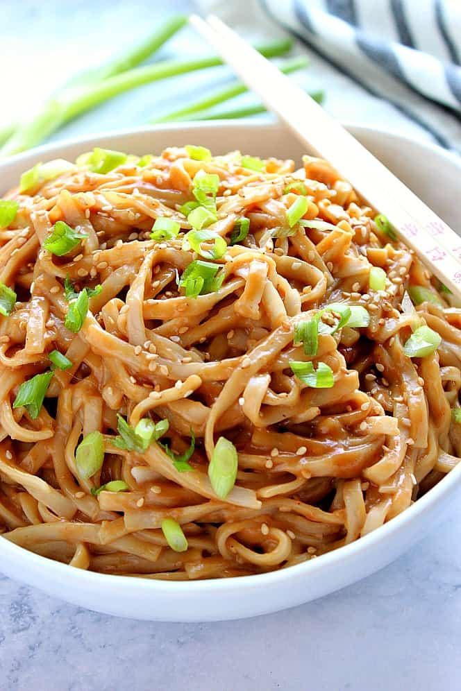

lang=en
# Lunch
## Eggs
### Devilled eggs
also=h1:Dinner;h2:Starter
#### Ingredients
- 4 large eggs
- Mayonnaise
- salt and pepper
- Chives (optionnal)
#### Instructions
1. Place the eggs in a bot with lightly salted water and place on the stove.
2. Heat to medium-high until the water starts simmering, the reduce to medium and let cook for 10 minutes.
3. Remove the eggs from the water and remove their shell.
4. Scoop out the yolks and place them in a separate plate.
5. Mix the yolks with mayo, salt and pepper and the chives
6. Fill the whites back up with the yolks and serve.
## Rice & Noodles
### Tuna rice
1-2 Servings, ~15 minutes
tags=bestOf
also=h1:Dinner
#### Ingredients
- Jasmine rice
- Canned tuna
- Rice vinegar
- Soy sauce
- Mayo
- Tomato/Tomato paste
- Other
#### Instructions
1. Pour a portion of rice into the bottom of a saucepan
2. Rinse the rice thoroughly, only stopping once the water is only slightly white
3. Fill with water until there's about 1 finger knuckle high of water
4. Add a pinch of salt, rice vinegar and soy sauce to the saucepan and put on the fire, covering the saucepan with a lid
5. While the rice is cooking, take the canned tuna and drain the oil out of the can
6. Remove the tuna from the can into a mixing bowl, making  sure to fluff up the tuna
7. Place the cooked rice into the mixing bowl and add the mayo, tomatoes/tomato paste and other ingredients.
8. Add soy sauce to taste and serve

# Dinner
## Chicken
### Curry Chicken
3~4 servings
#### Ingredients
- 2 Chicken breast
- 3 Potatoes
- 2 Carrots
- Curry Powder
- 1 Onion
- 2 cloves of garlic
- Laurel leaf (optional) 
- Rice (optional)
- Other ingredients or spices to taste
#### Instructions
1. Chop the onion and crush the garlic. Place both into a pot with olive oil and let the onions soften on medium heat while chopping the other ingredients
2. Clean and peel the potatoes and carrots into 1/2 inch to 1 inch cubes. Place aside.
3. Take the chicken breast and cut into 1/2 inch cubes or slices.
4. Place the chicken and vegetables into the pot. Mix in the curry powder and fill the pot with water until all the ingredients are covered.
5. Add the laurel leaf and other ingredients and let simmer for around 30 minutes or until the potatoes and carrots are cooked and soft.
6. While the curry is cooking, cook 3 to 4 cups of rice.
7. Serve with curry poured over a serving of rice and enjoy. 
## Beef
### Filet mignon and potatoes
2 Servings, ~30 minutes
#### Ingredients
- 2 pieces of filet mignon steak
- Steak spices
- Grelot potatoes 
- 1 tablespoon of butter
#### Instructions
1. Place a pot filled with water medium-high heat and add the potatoes to it. 
2. Place a medium pan on high heat, placing olive oil in it to prevent the meat from sticking to it
3. Spread the spices on both sides of the steak
4. Place the steak in the pan and cook each side for about 5 minutes or cook to liking
5. Once done, remove the steak from the pan and place to rest.
6. Once the potatoes are done cooking (a small knife can go through a potato without resistance), empty in a strainer and pour the potatoes back into the empty pot.
7. Put the butter in the pot, using the remaining heat to melt the butter and stir the potatoes, making sure the butter is spread nicely.
8. Serve the steak with the potatoes to the side and enjoy.
## Rice & Noodles
### Sesame peanut noodles
4 Servings, ~20 minutes

#### Ingredients
- ½ cup peanut butter(120 g)
- 3 tablespoons low-sodium soy sauce
- 2 tablespoons sesame oil
- 2 tablespoons rice vinegar
- 3 tablespoons water
- 2 ½ teaspoons brown sugar
- 1 clove garlic
- ½ tablespoon minced fresh ginger
- 8 oz noodles(240 g), cooked according to package instructions and drained
- ½ cup shredded red cabbage(50 g)
- chopped peanut, for garnish
- 1 tablespoon black sesame seeds, for garnish
- sliced scallion, for garnish
#### Instructions
1. In a blender, combine the peanut butter, soy sauce, sesame oil, rice vinegar, water, brown sugar, garlic, and ginger and blend until smooth.
2. In a large bowl, combine the noodles, carrots then pour over the peanut sauce. Use tongs to toss well until the sauce is fully incorporated.
3. Divide the noodles between serving bowls and garnish with peanuts, black sesame seeds, and scallions.
# Desert
## Cookies
### Kraft Peanut butter cookies
24 cookies
sort=Peanut butter cookies
#### Ingredients
- 1 cup peanut butter
- 1/2 cup sugar
- 1 egg
#### Instructions
1. Heat oven to 325F.
2. Mix ingredients until blended.
3. Roll into 24 balls. Place 2 inches apart on baking sheets. Flatten each in criss cross pattern with a fork.
4. Bake 15 minutes. Cool on baking sheet 5 minutes. Remove to wire rack; cool completely.
## Baking
### Apple tart

#### Ingredients
##### For the dough
- 2 cup all-purpose flour
- 10 tablespoons butter, at room temperature 
- Pinch of salt 
- 4 tablespoons cold water 
##### For the tart
- 2 pounds apples (preferably renette: Golden Delicious can substitute) 
- 6 tablespoons butter 
- 1/2 cup sugar 
#### Instructions
1. Mix all the dough ingredients together to obtain a soft dough. Do not overwork the dough.
2. Split the dough in 2, one with 2/3 of the dough, and the other with the rest. Wrap the dough in plastic and refrigerate it for 30 minutes.
3. Preheat the oven to 325°F. Peel and core the apples, then cut each one into 8 wedges. 
4. Place the bigger piece of dough in a pie tray and place half the butter, 5 tablespoons of sugar and the apples.
5. Cook the pie on the **STOVE** until the sugar caramelizes, around 15 minutes.
6. Remove the pie from the over and put in the rest of the butter and sugar. Close the pie with the rest of the dough and make vent holes with a fork.
7. Cook the pie for around 30\~45 minutes or until the top of the pie is golden brown and serve.
## Pastry
### Coffee cream puff

## Other
### Meringues
~10 Meringues
#### Ingredients
- 3 large egg whites (3 ounces or 90 grams)
- 1/4 teaspoon cream of tartar
- 3/4 cup (150 grams) superfine or caster sugar (if you don't have superfine sugar simply take granulated white sugar and process it for about 30-60 seconds in a food processor)
- 1/4 teaspoon pure vanilla extract
- 1/4 cup shaved Almonds (optional)
#### Instructions
1.  Preheat oven to 200 degrees F (95 degrees C) and place the rack in the center of the oven. Line a baking sheet with parchment paper. You can form the cookies with a pastry bag fitted with a 1/2 inch (1.25 cm) plain tip, or I often just use two spoons to make the cookies. 
2. In the bowl of your electric mixer, with the whisk attachment, beat the egg whites on low-medium speed until foamy. Add the cream of tartar and continue to beat the whites until they hold soft peaks. Add the sugar, a little at a time, and continue to beat, on medium-high speed, until the meringue holds very stiff peaks. Beat in the vanilla extract.  
	>Note: The meringue is done when it holds stiff peaks and when you rub a little between your thumb and index finger it does not feel gritty. If it feels gritty the sugar has not fully dissolved so keep beating until it feels smooth between your fingers.
3. Before placing the cookies on the cookie sheet, place a little of the meringue on the underside of each corner of the parchment paper. This will prevent the paper from sliding.  Transfer the meringue to a pastry bag fitted with a 1/2 inch (1.25 cm) tip. Pipe 2 1/2 inch (6 cm) rounds of meringue in rows on the prepared baking sheet. Alternatively, spoon mounds of meringue, using two spoons, onto the prepared sheets. Sprinkle the tops of the cookies with a few shaved almonds, if desired.
4. Bake the meringues for approximately 1 1/2 to 1 3/4 hours, rotating the baking sheet from front to back (about half way through) to ensure even baking. The meringues are done when they are pale in color and fairly crisp. (The meringues will release easily from the parchment paper.) Turn off the oven, open the door a crack, and leave the meringues in the oven to finish drying several hours or overnight. The meringues can be covered and stored at room temperature for several days.