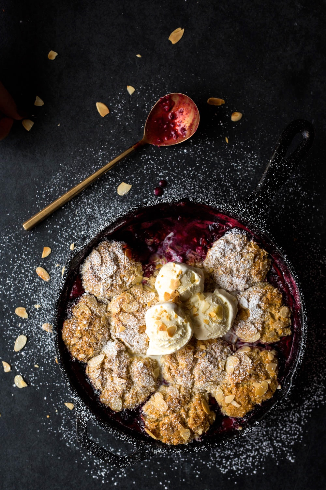

lang=en,fr
# Breakfast
## Baking
### Crêpes
#### Ingredients
- 1 tasses de farine
- 1 c. à thé de sel
- 2 gros oeufs
- 1 c. à soupe de sucre (ou sirop d'érable)
- 1 1/2 tasses de lait
- 1 c. à soupe de beurre fondu
#### Instructions
1. Mélanger la farine et el sel dans un grand bol.
2. Dans yun autre bol, battre kes oeufs.
3. Ajouter le lait, le sucre et le beurre.
4. Pour ne pas avoir de grumeaux, faire un trou dans la farine et verser tranquillement le mélange mouillé en brassant.
5. Continuer jusqu'à ce que la farine soit tout intégré dans le mélange.
6. Faire cuire dans poêle jusqu'à ce que la crêpe soit doré et les rebords lèvent de la poêle.  
### Pain aux bananes
sort=banana bread
also=h1:Desert
#### Ingredients
- 1 1/2 tasse de farine tout usage non blanchie

- 1 c. à thé de poudre à pâte
1 c. à thé de bicarbonate de soude

- 1 1/4 tasse de bananes mûres écrasées à la fourchette (3 à 4 bananes)

- 1/2 tasse de lait d’amandes
1/2 tasse de beurre non salé, ramolli
- 3/4 de tasse de sucre

- 1 oeuf
- 1 c. à thé d’extrait de vanille
#### Instructions
1. Placer la grille au centre du four. Préchauffer le four à 180 °C (350 °F). Beurrer un moule à pain de 23 x 13 cm (9 x 5 po) d’une contenance de 1,5 litre (6 tasses) et le tapisser d’une bande de papier parchemin en le laissant dépasser sur deux côtés.
2. Dans un bol, mélanger la farine, la poudre à pâte et le bicarbonate. Réserver.
3. Dans un autre bol, mélanger les bananes, le lait d’amandes. Réserver.
4. Dans un troisième bol, crémer le beurre avec le sucre au batteur électrique. Ajouter l’oeuf, la vanille et mélanger jusqu’à ce que la préparation soit homogène.
5. À basse vitesse, incorporer les ingrédients secs en alternant avec le mélange de bananes.
6. Répartir la préparation dans le moule à pain. Cuire au four environ 1 heure ou jusqu’à ce qu’un cure-dent inséré au centre de la pâte en ressorte propre. Cuire environ 20 min pour cup cakes
8. Laisser tiédir sur une grille avant de démouler et de trancher.
### Lemon Ricotta Pancakes
#### Ingredients
- 2 ½ cups all-purpose flour
- ½ cup light brown sugar
- 2 tbsp + 1 tsp baking powder
- 1 tsp salt
- 4 eggs
- 10oz whole milk ricotta cheese
- 2 cups whole milk
- 1 tbsp lemon juice
- 2 tsp lemon zest
- 2 tsp vanilla extract
- butter, to cook
- warm maple syrup
- powdered sugar
#### Instructions
1. Whisk the flour, brown sugar, baking powder, and salt together in a large bowl until incorporated.
2. In a separate bowl, beat the eggs. Add in the ricotta cheese and whisk until smooth. Add the milk, lemon juice, lemon zest, and vanilla to the egg mixture. Whisk to combine.
3. Slowly pour the wet ingredients into the flour mixture, whisking until the flour soaks up the liquid and the mixture is homogenous.
4. Heat a griddle or skillet over medium heat. Working in batches, add a tablespoon of butter at a time to the griddle or skillet and let melt (it will take only seconds).
5. Ladle the pancake batter onto the surface, creating your desired size pancakes and evenly spacing them apart. Cook on one side until golden brown and bubbles begin to form on the top. Using a spatula, flip the pancake over and finish cooking on the other side.
# Dinner
## Starter
### Biscuits Aperitif fromage
4 à 5 douzaines
#### Ingredients
- 1 1/2 tasses de farine non blanchie
- 1 c. à the de sel
- poivre
- 4 oz beurre doux
- 9 oz de cheddar extra-fort râpé grossièrement
#### Instructions
1. Préchauffer le four à 200 C (400 F).
2. Dans le bol du robot, mélanger tous les ingrédients jusqu'à la formation d'une boule qui roule sur la lame.
3. Déposer la pâte sur une pellicule plastique.
4. Former un cylindre. Réfrigérer bien à plat.
5. Au moment de cuire, trancher le bâton de pâte en trance de .5 cm (1/4 pouce). Disposer sur une plaque.
6. Cuire 10 à 12 minutes ou jusqu'à ce que les biscuits soient dorés.
7. Les refroidir sur une grille.
## Eggs
### Omelette champignons et fromage
#### Ingredients
- I stick unsalted butter
- 5 cups leek julienne (1 1/2 - 2 poireaux)
- 1/2 lb fresh shiitake mushrooms, stemmed + cut
- 1/2 lb paper thin sliced prosciutto
- 5 cups whipping cream
- 12 large eggs
- 1 tbsp fully grated nutmeg
- 1 tbsp salt
- freshly ground pepper
- 2 1/2 cups freshly grated Gruyère
- minced fresh parsley
#### Instructions
1. Sauté leeks 8 minutes.
2. Add mushrooms 5 minutes.
3. Add prosciutto 2 min.
4. Verser dans baking dish.
5. Four a 375F.
6. Mélanger crème, nutmeg, eggs, sel poivre, fromage.
7. Verser liquide dans légumes et mélanger.
8. Cuire 30 minutes.
## Beef
### Osso bucco
#### Ingredients
- 4 ( 4 ) tranches de jarrets de veau de 250 g (9 oz) chacun
- Farine
- Huile d’olive
- 2 carottes râpées
- 2 oignons hachés
- 1 tasse ( 250 ml ) de vin blanc
- 6 tomates italiennes en conserve (au choix)
- 3 tasses ( 750 ml ) de bouillon de poulet
- 1 c. à thé ( 5 ml ) de basilic séché
- 1 c. à thé de thym séché
- 1 c. à thé ( 5 ml ) de persil séché
- 1 c. à thé d’oregan
- 1 feuille de Laurier
- Sel et poivre
#### Instructions
1. Fariner les jarrets de veau.
Dans une casserole, chauffer un peu d’huile à feu moyen-vif.  Faire colorer la viande environ 2 minutes de chaque côté ou jusqu’à qu’elle soit bien dorée. 
2. Retirer les morceaux de viande.
3. Ajouter les carottes et les oignons dans la casserole. Faire revenir 2 minutes.
4. Déglacer avec le vin.
5. Ajouter les tomates, le bouillon et les herbes et la feuille de laurier.
6. Saler et poivrer au goût.
7. Remettre la viande sur les legumes
8. Porter à ébullition, réduire le feu et laisser mijoter 2 heures à mi-couvert ou cuire au four à 300 ºF pendant 2 heures (ou jusqu’à ce que la viande soit tendre).
### Taco Seasoning
#### Ingredients
- 1 teaspoon ground chili powder 
- 1 teaspoon ground cumin 
- 1 teaspoon garlic powder 
- 1 teaspoon onion powder 
- 1 teaspoon dried oregano 
- 1/2 teaspoon cayenne powder 
- 1 teaspoon Kosher salt
# Desert
## Puddings & Mousse
### Cobbler framboises et vanille
8 Servings, 20 minutes prep, 50 minutes cook

#### Ingredients
##### Garniture
- 6 tasses (1,5 litre) de framboises congelées, décongelées
- 1/3 tasse (80 ml) de sucre
- 2 c. à soupe (30 ml) de fécule de maïs
- Graines de 1 gousse de vanille ou 1 c. à thé (5 ml) de vanille
- Zeste de 1/2 citron
- Jus de 1/2 citron
##### Pâte
- 1 tasse (250 ml) de farine sans gluten    
- 1 tasse (250 ml) de poudre d’amandes
- 1 c. à soupe (15 ml) de poudre à pâte
- 1/3 tasse (80 ml) de sucre
- 1/4 c. à thé (1,25 ml) de sel
- 6 c. à soupe (90 ml) de margarine sans produits laitiers froide
- 3/4 tasse (180 ml) de crème de soya Belsoy  
- 1 c. à thé (5 ml) de vanille
- 1/4 tasse (60 ml) d’amandes tranchées
- 2 c. à soupe (30 ml) de sucre brut
#### Instructions
##### Garniture
1. Placer la grille au centre du four préchauffé à 350°F.
2. Déposer tous les ingrédients de la garniture dans une poêle en fonte ou dans un moule carré de 8 x 8 po. Mélanger délicatement le tout.
##### Pâte
1. Dans un grand bol, mélanger la farine, la poudre d’amandes, la poudre à pâte, le sucre et le sel.
2. Sabler la margarine et les ingrédients secs avec un coupe-pâte ou avec les doigts jusqu’à l’obtention d’une préparation grumeleuse.
3. Dans un petit bol, mélanger la crème de soya avec la vanille. Verser sur la préparation en mélangeant le tout délicatement avec une fourchette jusqu’à ce que la préparation se tienne.
4. Parsemer la pâte sur les fruits en formant de petits amoncellements. Saupoudrer d’amandes tranchées et de sucre brut.
5. Déposer le cobbler sur une plaque à biscuits et cuire de 40 à 50 minutes ou jusqu’à ce que la préparation de fruits bouillonne et que la pâte soit bien dorée. Servir chaud avec de la crème glacée à la noix de coco sans produits laitiers.
## Baking
### Monkey bread
10 Servings, 30 minutes prep, 45 minutes cooking
Preparation 30 MIN Cooking 45 MIN Waiting 1 H 45 MIN Servings 10
#### Ingredients
##### Brioche Dough
- 1 1/4 cups (310 ml) buttermilk, warm
- 1/4 cup (60 ml) sugar
- 3 cups (750 ml) unbleached all-purpose flour
- 2 teaspoons (10 ml) instant dry yeast
- 1/2 teaspoon (2.5 ml) salt
- 6 tablespoons (90 ml) unsalted butter, melted
##### Topping
- 1/2 cup (125 ml) unsalted or salted butter, melted
- 3/4 cup (180 ml) brown sugar
- 3/4 cup (180 ml) sugar
- 1 1/2 teaspoons (7.5 mL) ground cinnamon
#### Instructions
##### Brioche Dough
1. In a bowl, combine the buttermilk and sugar. Set aside.
2. With a wooden spoon or a in the stand mixer (using the dough hook), combine the flour, yeast and salt. Add the buttermilk mixture and mix thoroughly until the dough begins to form.
3. Gradually add the butter and knead for about 5 minutes in the stand mixer or on a floured surface. The dough will be soft and slightly sticky. Place the dough in a clean and lightly oiled bowl. Cover the bowl with a damp cloth and leave in a warm and humid place for about 1 hour.
4. Generously butter a bundt pan. Set aside. 
##### Topping
1. In a bowl, pour the melted butter. In another bowl, combine the brown sugar, sugar, and cinnamon. Set aside.
2.  Remove the dough from the bowl and cut into approximately 40 pieces of various sizes. Without overworking the dough, shape balls with the palm of your hands.
3. Dip the balls in the butter to coat. Roll in the brown sugar mixture and place them progressively into the pan. Pour the remaining brown sugar mixture and butter on the dough balls into the pan. Cover with plastic wrap and let rise in a warm and humid place for 45 minutes.
4. With the rack in the middle position, preheat the oven to 180 °C (350 °F).
5. Remove the plastic wrap and bake for 40 minutes for a dark bundt pans or for 45 minutes for a pale bundt pan, or until the caramel is golden brown and bubbly around the edges. Immediately unmould on a serving platter. Let cool for 15 minutes before serving. Eat warm or cold, preferably the same day.
### Madeleines (Daniel Boulu)
#### Ingredients
- 3/4 tasse de farine
- 1 tsp baking powder
- 1/2 c. A the de sel
#### Instructions
1. Wish 2 large eggs with 1/3 de tasse de sucre, 1 c. a table de miel, 2 c a the de zeste de citron ou orange
2. Ajouter les ingredients secs
3. Ajouter 6 c. a table de beurre non-sale fondu
4. Transferer dans un sac de plastique pour 1 heure
5. Cuire a 400 8 à 10 minutes.
### Tarte feuilleté aux pommes
sort=apple tart
#### Ingredients
- 200 g (8 onces) de pâte feuilletée du commerce dégelée* de 25 x 25 cm (10 x 10 po)
- 1 oeuf battu
- 3 pommes Spartan ou Cortland pelées, épépinées et coupées en fins quartiers de ½ cm (1/4 po) 
- 125 ml (1/2 tasse) de sucre granulé
- 60 ml (1/4 tasse) de crème fraîche 
- 45 ml (3 c. à soupe) d’amandes effilées
- 30 ml (2 c. à soupe) de sucre en poudre pour la décoration (facultatif)
#### Instructions 
1. Préchauffer le four à 400°F.
2. Tapisser une grande plaque à cuisson de papier parchemin et y déposer le carré de pâte feuilletée.
3. Badigeonner avec l’œuf battu environ ½ cm (1/4 po) sur tout le pourtour de la pâte.
4. Replier le rebord vers l’intérieur et sceller uniquement le joint à l’aide des dents d’une fourchette.
5. Piquer abondamment l’abaisse à l’aide d’une fourchette à l’exception des rebords.
6. Dans un bol, mélanger les quartiers de pomme avec 30 ml (2 c. à soupe) de sucre granulé. Étaler joliment sur l’abaisse.
7. Badigeonner les rebords d’œufs battus.
8. Cuire au four de 20 à 25 minutes.
9. Pendant ce temps, battre la crème fraîche, le reste de l’œuf battu et le reste de sucre granulé. Verser sur les pommes, parsemer des amandes et poursuivre la cuisson 15 minutes.
10. Tempérer 10 minutes avant de servir, puis saupoudrer de sucre glace.
### Tarte au sirop d'érable
#### Ingredients
- 2 gros œuf
- ½ tasse de sirop d'éralle foncé ou grade B
- 6 cuill à table de Cassonade
- 3/4 d'un baton beurre non-salé (6 c. à table)
- 1 1/2 c à table de vinaigre de cidre
- 1/8 c à thé de sel (ronde)
- 2/3 tasse de pacanes (2 1/2 oz), haché finement
## Cake
### Gâteau aux carottes de Mme. Chevalier
tags=bestOf
sort=carrot cake
#### Ingredients
##### Gâteau
- 3 oeufs
- 1 1/2 tasse de sucre
- 1/2 tasse d'huile
- 2 tasses de farine
- 1 c. à thé de soda
- 2 c. à th. de cannelle
- 1/2 c. à thé de sel
- 2 c. à thé de vanille
- 3/4 tasses de lait
- 2 tasses de carottes râpées
- 1/2 tasses d'ananas broyés
- 1 tasse de noix
- 1 tasse de noix de coco
##### Glaçage
- 250 g de fromage en crème
- 1 c. à table de beurre
- 1 c. à table de lait
- 1 c. à thé de vanille
- ~3+ tasses de sucre en poudre
#### Instructions
##### Gâteau
1. Mélanger les ingrédients ensemble.
2. Verser dans un moule à gâteau.
3. Cuire 350. 35 a 40 minutes.
##### Glaçage du fromage à la crème
1. Mélanger le fromage, le beurre, le lait et la vanille
2. Ajouter le sucre en poudre. 
3. Ajouter plus de sucre à l'œil pour avoir la consistance désirée, coulant mais pas trop.
### Gateau fondant au chocolat
#### Ingredients
- 5 oeufs
- 5 jaunes d’oeuf
- 1/2 tasse ( 75 ml ) de sucre
- 8 oz ( 220 g ) de chocolat noir 65%, haché
- 1 tasse ( 250 ml ) de beurre non salé
- 1/3 tasse ( 75 ml ) de farine tout usage
#### Instructions
1. Mélanger les œufs, les jaunes et le sucre, fouetter pour blanchir les œufs ou jusqu’à ce qu’ils tombent en ruban.
2. Dans la partie supérieure d’un bain-marie, faire fondre le chocolat et le beurre.
3. Incorporer le mélange d’œuf au chocolat fondu. 
4. Tamiser la farine sur la préparation, l’incorporer en pliant.

5. Verser dans des 10 à 12 ramequins en porcelaine ou dans de petits moules en aluminium jetables, beurrés, saupoudrés de sucre ou de cacao.
6. Réserver au frigo 1 h 30 minutes à 1 semaine et même 10 jours.
7. Au service, préchauffer le four à 250 °C / 500 °F.
Cuire les petits gâteaux 6 minutes, le centre sera très coulant. Pour un centre un peu plus ferme, cuire de 7 à 8 minutes.
8. Accompagner d’un coulis de fruit, ou d’une glace ou d’un sorbet ou d’un caramel ou d’une crème anglaise.
### Gâteau Georgette
recette a été doublée
#### Instructions
1. Mélanger: 4 œufs bien battus, 2 tasse de sucre
2. Ajouter: 2 tasse farine, 2 c. Thé poudre à pâte, 2 c. Thé d'essence d'amande, 1 tasse de lait, 2 c. Table beurre fondu.
3. Cuire à 300 - 325. 30 minutes dans un moule à pain pas trop grand.
## Cookies
### Banana Cookies
3 Dozen Servings 
tags=bestOf
#### Ingredients
- 1 cup all-purpose flour
- ½ cup whole-wheat flour
- 1 teaspoon coarse salt (fleur de sel)
- ½ teaspoon baking soda
- ¾ cup (1½ sticks) unsalted butter, softened
- ½ cup granulated sugar
- ½ cup packed light-brown sugar
- 1 large egg
- 1½ teaspoons pure vanilla extract
- 1 cup mashed ripe banana (about 2 large) (Use a ripe banana, which has more concentrated flavor than an unripe one)
- 1 cup old-fashioned rolled oats
- 8 ounces semisweet chocolate, coarsely chopped into ¼-inch chunks
- ½ cup coarsely chopped walnuts (about 2 ounces), toasted *(optional)*
#### Instructions
1. Preheat oven to 375°F. Whisk together flours, salt, and baking soda in a small bowl; set aside.
2. Put butter and sugars into the bowl of an electric mixer fitted with the paddle attachment; mix on medium speed until pale and fluffy.
3. Reduce speed to low. Add egg and vanilla; mix until combined. Mix in banana.
4. Add flour mixture; mix until just combined. Stir in oats, chocolate chunks, and walnuts.
5. Using a 1½-inch ice cream scoop, drop dough onto baking sheets lined with parchment paper, spacing about 2 inch-es apart.
6. Bake cookies, rotating sheets halfway through, until golden brown and just set, 12 to 13 minutes.
7. Let cool on sheets on wire racks 5 minutes. Transfer cookies to wire racks; let cool completely. Cookies can be stored in airtight containers up to 2 days.